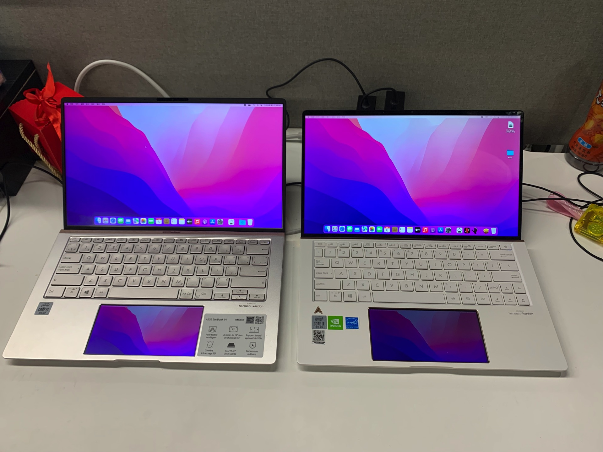
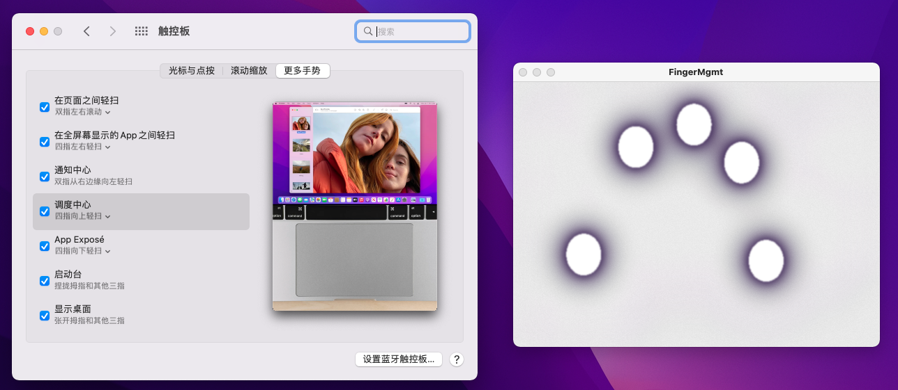
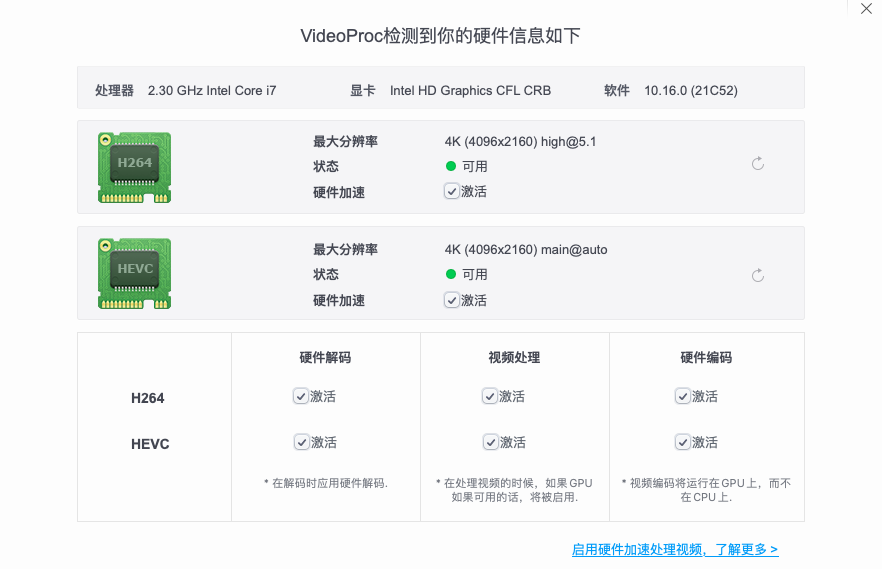
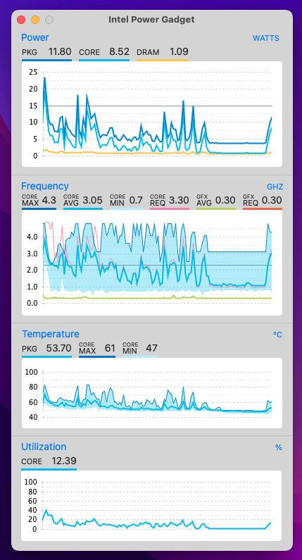
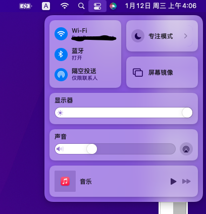
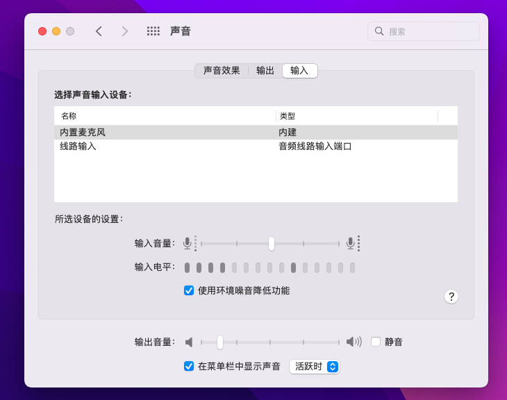
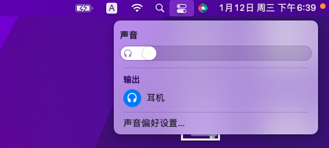
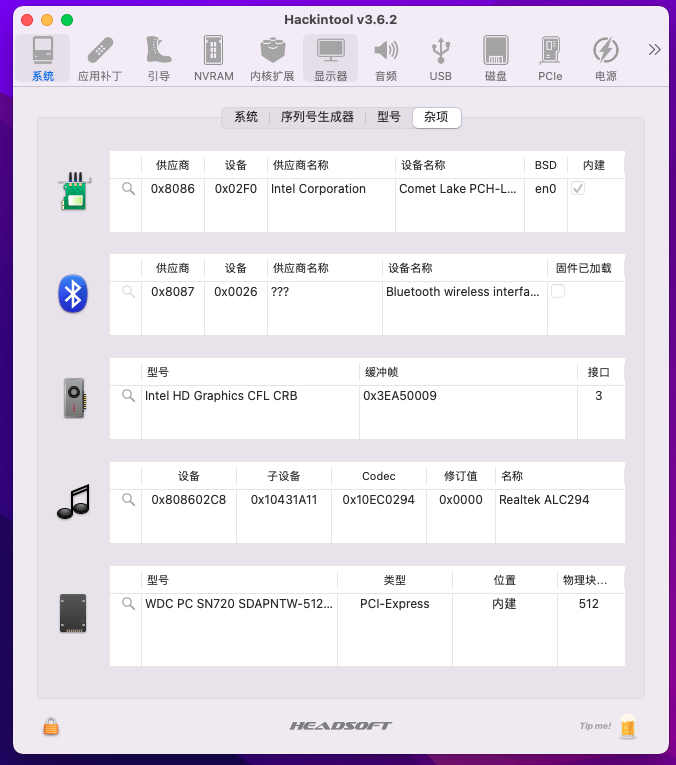
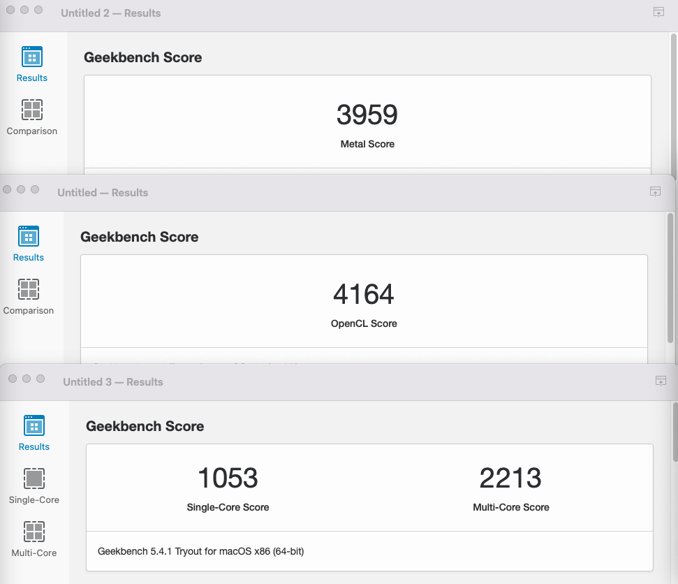
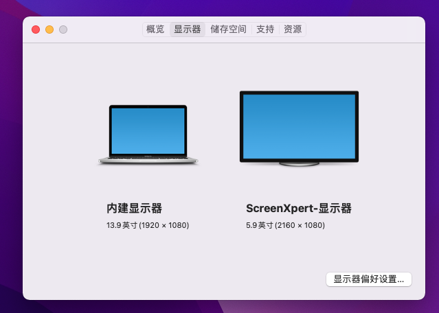

# ASUS-ZenBook14-UX434FLC

 

## 配置概览

 

| Component | Brank                                            |
| --------- | ------------------------------------------------ |
| CPU       | intel Core i7-10510U                             |
| GPU       | Intel UHD Graphics 630 \+ NVIDIA  GeForce MX250  |
| SSD       | WDC SN720 NVME 512GB                             |
| Display   | 京东方 BOE07E9 1920x1080 + ScreenXpert 2160x1080 |
| SMBIOS    | MacBookPro15,2                                   |
| WiFi      | Intel  AX201                                     |

## 驱动细节

### 触控板

完美支持多指手势

而且工作在 GPIO 中断下：

  

### 显卡

双硬解正常：

 

Hackintool 里面也显示 VDA 解码正常：

  

目前双屏工作良好：

  

### CPU

CPU 变频正常：

 

### WiFi 和蓝牙正常

 

### 声卡

麦克风、扬声器均正常使用：

 

可以正常使用 Siri： 

   

支持耳机自动切换：

 

蓝牙和 WiFi 也正常：

 

### USB

所以 USB 均定制过：

 

这里比较坑的点就是如果 USB 定制不完美的话，蓝牙就无法使用了。

### 读卡器

自带的读卡器也可以打 kexts 来驱动，比较省心：

 

### 电池

电池容量和状态正常：

 

一些进阶参数：

 

### Geekbench5

最后上下跑分情况：

 

中规中矩吧，性价比和 MBP 比起来的话已经很高的了。

## Tips

双屏笔记本的触控板屏幕和外置 HDMI 可能有冲突？国光我这里没有让他们共存过，所以打包了两份 EFI，有解决方法发朋友欢迎提交 PR。

 

外接 HDMI 也是可以的，由于 HDMI 接口为 1.4 所以建议外接 2k 及其以下显示器，使用 EFI for HDMI 这个文件夹的配置即可，这里就不上截图了  。

